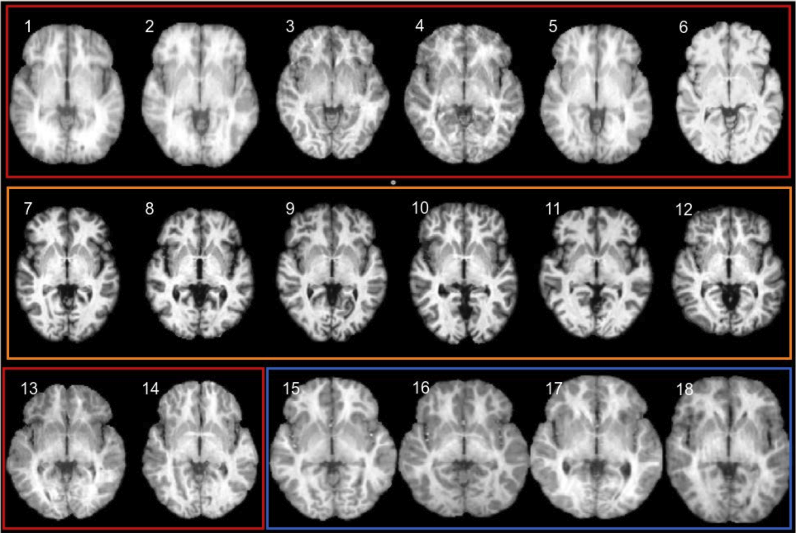
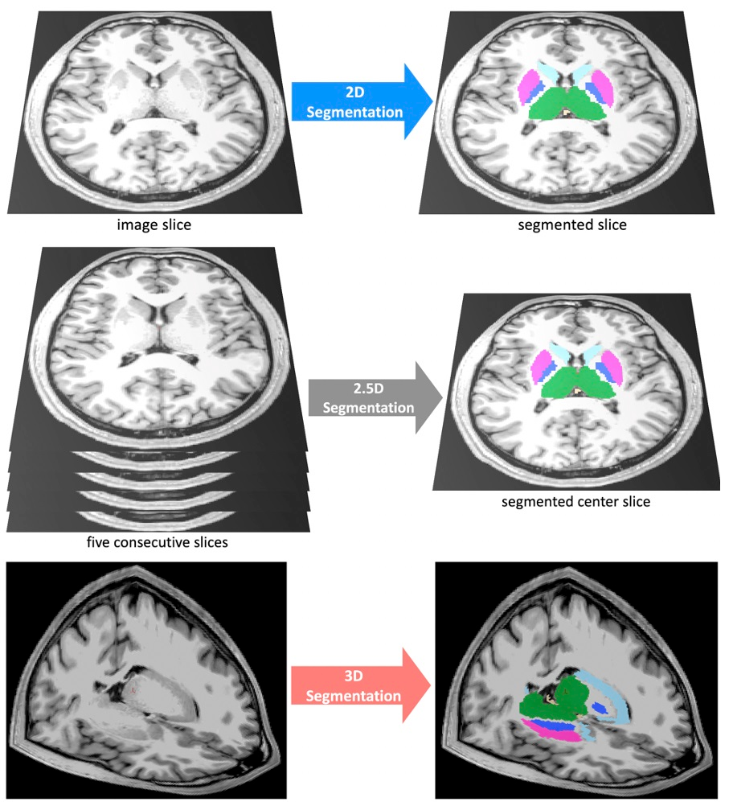
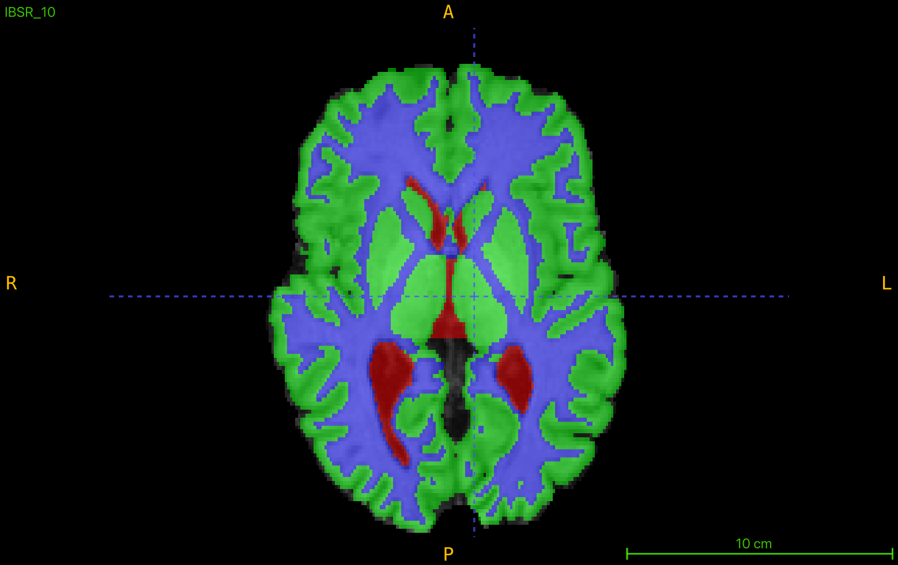
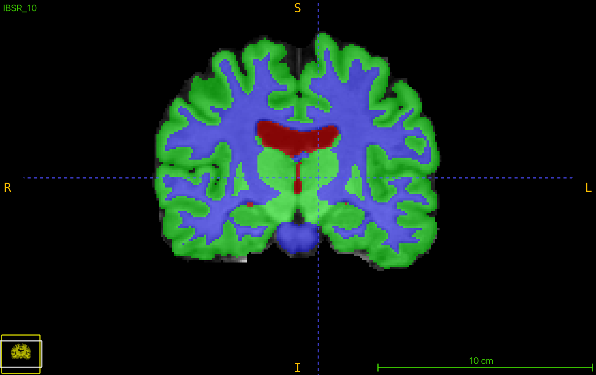
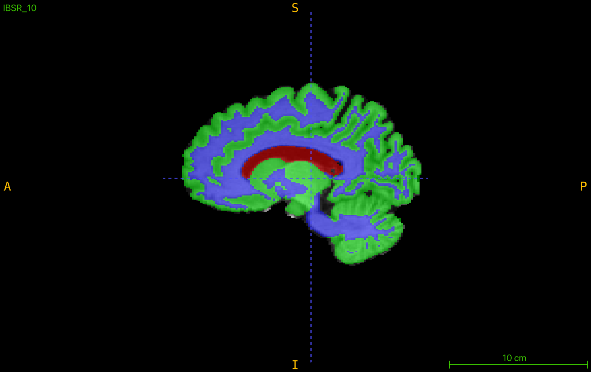

# Brain Segmentation
This repository is a collection of scripts and notebooks for brain segmentation using deep learning which is part of the project for the course "Medical Image Segmentation" at the University of Girona on my Master's degree.

## Table of Contents
1. [Introduction](#introduction)
2. [Data](#data)
3. [Preprocessing](#preprocessing)
4. [Model](#model)
5. [Training](#training)
6. [Evaluation](#evaluation)
7. [Results](#results)
8. [Conclusion](#conclusion)

## Introduction
This project aims to segment the brain from MRI images using deep learning

## Data
The dataset used in this study is the IBSR18, containing 18 T1-weighted scans of normal subjects from the Internet Brain Segmentation Repository (IBSR). It includes preprocessed scans with a 1.5 mm slice thickness and ground truth segmentation for white matter (WM), gray matter (GM), and cerebrospinal fluid (CSF).

Figure 1: IBSR18 dataset

## Preprocessing

### Slice-Based Segmentation
- Description: Processes 2D slices extracted from 3D brain MRI volumes for segmentation tasks.
- Steps:
    - Normalize intensity values for consistent pixel distributions.
    - Apply data augmentation techniques (e.g., rotations, flips) to enhance training diversity.

### Full Volume Segmentation
- Description: Directly processes full 3D MRI volumes to retain spatial context and provide higher segmentation accuracy.
- Steps:
    - Normalize intensity values.
    - Z-score normalization standardizes pixel intensities.
    - Apply 3D augmentations such as affine transformations and bias field adjustments.

### Patch-Based Segmentation
- Description: Focuses on smaller patches extracted from 3D volumes, balancing computational efficiency with model accuracy.
- Steps:
    - Extract fixed-size patches using uniform or foreground-focused sampling.
    - Normalize patches and apply augmentations.
    - Z-score normalization standardizes pixel intensities.
    - Weighted sampling prioritizes regions with brain tissue to improve sensitivity.

    <figure>
        
        <figcaption><b>Figure 2: Segmentation Strategies</b></figcaption>
    </figure>

## Model
The repository includes several deep learning architectures evaluated for brain MRI segmentation:
- 2D Models: U-Net and EfficientNet-based models tailored for slice-based segmentation.
- 3D Models: Includes 3D U-Net, UNETR, and SegResNet for volumetric segmentation, leveraging spatial context across slices.
- Patch-Based Models: Designed to process small 3D patches with emphasis on critical regions, such as CSF, GM, and WM, while mitigating class imbalance.

## Training
The training pipeline supports:
- Custom loss functions, including Dice Loss, Focal Loss, and a combination of both.
- Weighted sampling during patch-based training to focus on foreground regions.
- Dynamic learning rate adjustment using Cosine Annealing.
- Dropout 10% for regularization.
- Integration with MLflow and DagsHub for experiment tracking, logging, and reproducibility.

## Evaluation
- Metrics:
    - Dice Score: Measures overlap between predictions and ground truth.
    - Hausdorff Distance (HD): Evaluates boundary matching.
    - Average Volume Difference (AVD): Quantifies volume discrepancies.

## Results
Below are the results obtained from the experiments conducted on the IBSR18 dataset.
### Slice-Based Segmentation Evaluation

| **Experiments**            | **Dice Score (CSF)** | **Dice Score (GM)** | **Dice Score (WM)** | **Dice Score (Avg)** | **HD (CSF)** | **HD (GM)** | **HD (WM)** | **HD (Avg)** | **AVD (CSF)** | **AVD (GM)** | **AVD (WM)** | **AVD (Avg)** |
|-----------------------------|----------------------|----------------------|---------------------|----------------------|--------------|-------------|-------------|--------------|---------------|--------------|--------------|---------------|
| Coronal + Sampler + Aug     | 0.8459              | 0.9090              | 0.9168             | 0.8906              | 20.0007      | 13.6774     | 14.9360     | 16.2047      | 0.0069        | 0.0470       | 0.0452       | 0.0330        |
| Coronal                     | 0.7293              | 0.9046              | 0.9067             | 0.8469              | 20.1004      | 17.9091     | 8.9364      | 15.6486      | 0.1580        | 0.0145       | 0.0054       | 0.0593        |
| Sagittal                    | 0.8978              | 0.9276              | 0.9195             | 0.9150              | 21.2354      | **8.5844**  | 7.8491      | 12.5563      | 0.0241        | **0.0014**   | 0.0163       | 0.0139        |
| Axial                       | 0.9014              | 0.9241              | 0.9229             | 0.9162              | 13.2919      | 13.3132     | 12.3656     | 12.9902      | 0.0277        | 0.0163       | 0.0119       | 0.0186        |
| Coronal + Sampler           | 0.8671              | 0.9015              | 0.9151             | 0.8946              | 24.5062      | 23.8343     | 22.1061     | 23.4822      | 0.0233        | 0.0030       | 0.0489       | 0.0251        |
| Sagittal + Sampler          | 0.8968              | 0.9239              | 0.9125             | 0.9111              | 12.8219      | 8.2409      | **7.8716**  | 9.6448       | 0.0335        | 0.0046       | 0.0463       | 0.0281        |
| Axial + Sampler             | 0.9082              | 0.9261              | 0.9237             | 0.9193              | **12.0497**  | 13.1029     | 9.1734      | 11.4420      | **0.0016**    | 0.0145       | 0.0121       | 0.0094        |
| Ensemble                    | **0.9212**          | **0.9435**          | **0.9407**         | **0.9352**          | **11.6425**  | 9.0392      | 7.9693      | **9.5503**   | 0.0091        | 0.0042       | **0.0010**   | **0.0048**    |

### Volume-Based Segmentation Evaluation

| **Loss Function**              | **Dice Score (CSF)** | **Dice Score (GM)** | **Dice Score (WM)** | **Dice Score (Avg)** | **HD (CSF)** | **HD (GM)** | **HD (WM)** | **HD (Avg)** | **AVD (CSF)** | **AVD (GM)** | **AVD (WM)** | **AVD (Avg)** |
|--------------------------------|----------------------|----------------------|---------------------|----------------------|--------------|-------------|-------------|--------------|---------------|--------------|--------------|---------------|
| Dice Focal Loss                | 0.8852              | 0.9236              | 0.9096             | 0.9061              | 28.1306      | 14.2657     | 11.7589     | 18.0518      | 0.0066        | 0.0652       | 0.0703       | 0.0474        |
| Dice Cross Entropy Loss        | **0.9042**          | **0.9358**          | **0.9269**         | **0.9223**          | **11.8027**  | **10.4878** | **10.4681** | **10.9195**  | 0.0215        | 0.0023       | 0.0140       | 0.0126        |
| Dice Cross Entropy Loss + Aug  | 0.8820              | 0.9206              | 0.9057             | 0.9028              | 29.9572      | 13.7154     | 10.6235     | 18.0987      | **0.0009**    | **0.0010**   | **0.0259**   | **0.0092**    |

### Patch-Based Segmentation Evaluation

| **Configuration**     | **Dice Score (CSF)** | **Dice Score (GM)** | **Dice Score (WM)** | **Dice Score (Avg)** | **HD (CSF)** | **HD (GM)** | **HD (WM)** | **HD (Avg)** | **AVD (CSF)** | **AVD (GM)** | **AVD (WM)** | **AVD (Avg)** |
|------------------------|----------------------|----------------------|---------------------|----------------------|--------------|-------------|-------------|--------------|---------------|--------------|--------------|---------------|
| Patch 64              | 0.9246              | 0.9476              | 0.9431             | 0.9384              | 10.6180      | 8.3984      | 10.2294     | 9.7486       | 0.0208        | 0.0119       | 0.0078       | 0.0135        |
| Patch 64 + Sampler    | 0.9238              | 0.9470              | 0.9430             | 0.9379              | 8.8792       | **7.6025**  | 7.2603      | 7.9140       | **0.0117**    | 0.0145       | 0.0074       | 0.0112        |
| Patch 128             | 0.9252              | 0.9495              | 0.9438             | 0.9395              | 12.3265      | 8.4761      | 8.4534      | 9.7520       | 0.0188        | **0.0077**   | 0.0058       | **0.0107**    |
| Patch 128 + Sampler   | 0.9277              | 0.9455              | 0.9381             | 0.9371              | 14.8209      | 58.5632     | 7.6742      | 27.0194      | 0.0194        | 0.0200       | 0.0096       | 0.0163        |
| Ensemble              | **0.9305**          | **0.9517**          | **0.9470**         | **0.9430**          | **8.5560**   | 7.9178      | **7.0091**  | **7.8276**   | 0.0213        | 0.0128       | **0.0047**   | 0.0130        |

### Final Brain Tissue Segmentation Visualized Along Separate Axes

    <figure>
        
        <figcaption><b>Axial</b></figcaption>
    </figure>
    <figure>
        
        <figcaption><b>Coronal</b></figcaption>
    </figure>
    <figure>
        
        <figcaption><b>Sagittal</b></figcaption>
    </figure>

## Conclusion
The experiments demonstrated the effectiveness of deep learning for brain tissue segmentation:

- **Slice-Based Segmentation**: The addition of a data sampler significantly improved performance, addressing class imbalance. The ensemble approach of axial, coronal, and sagittal views achieved the best results with a Dice score of **0.9352**, Hausdorff Distance of **9.5503**, and AVD of **0.0048**.

- **Volume-Based Segmentation**: Dice Cross Entropy Loss outperformed Focal Loss, providing better segmentation accuracy and boundary alignment due to its balanced optimization of class overlap and pixel-wise classification.

- **Patch-Based Segmentation**: Smaller patches (64x64x64) with a data sampler showed strong performance. The ensemble of patch-based models achieved the highest Dice score (**0.9430**), lowest Hausdorff Distance (**7.8276**), and consistent AVD (**0.0130**).

In summary, data samplers and ensemble strategies were critical in addressing class imbalance and improving segmentation accuracy, while augmentation showed limited benefit. 